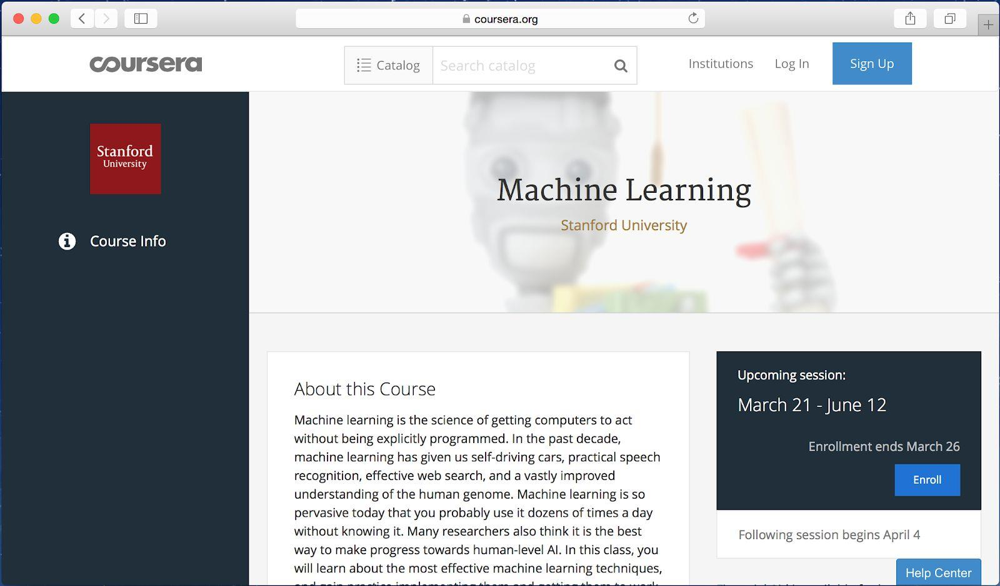

## Chapter 3 预备知识和表示符号

如果你已经学过一些机器学习课程比如我在Coursera平台上讲的机器学习公开课，或你有一些应用监督学习的经验，你将能够理解本内容。

我假设你对有监督学习很熟悉：通过使用有标签的训练样例（x，y），来学习一个从x映射到y的函数。有监督学习算法包括线性回归（linear regression），逻辑回归（logistic regression）和神经网络(neural networks)。机器学习有很多形式，但大多数有实践意义的机器学习算法主要来自于有监督学习。

我会经常性的提及神经网络（也叫作“深度学习”）。你也需要对神经网络有一些基本的了解才能继续本内容。

如果你对上面提及的概念都不是很熟悉，请观看在Coursera上机器学习课程的前三周视频内容，网址是http://ml-class.org 。

