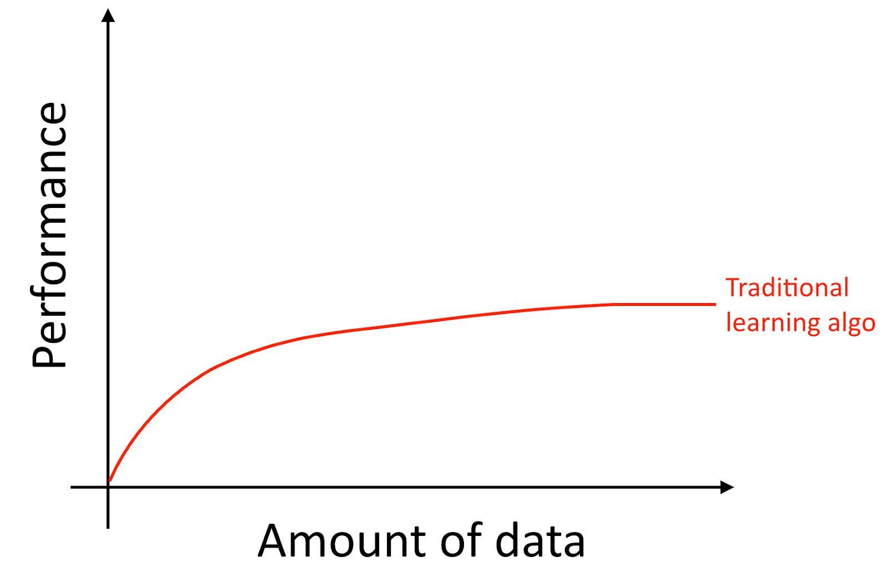
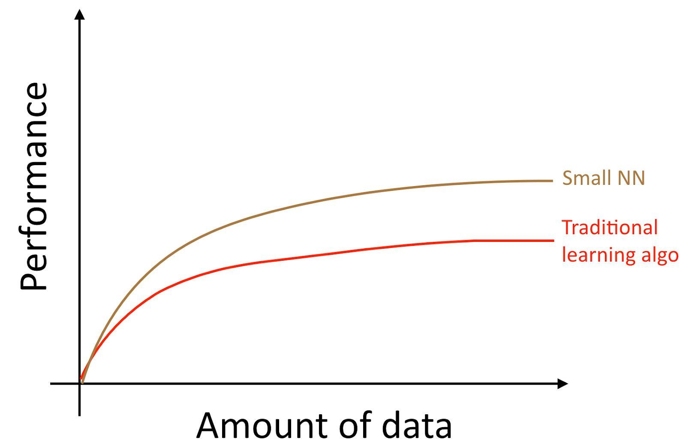
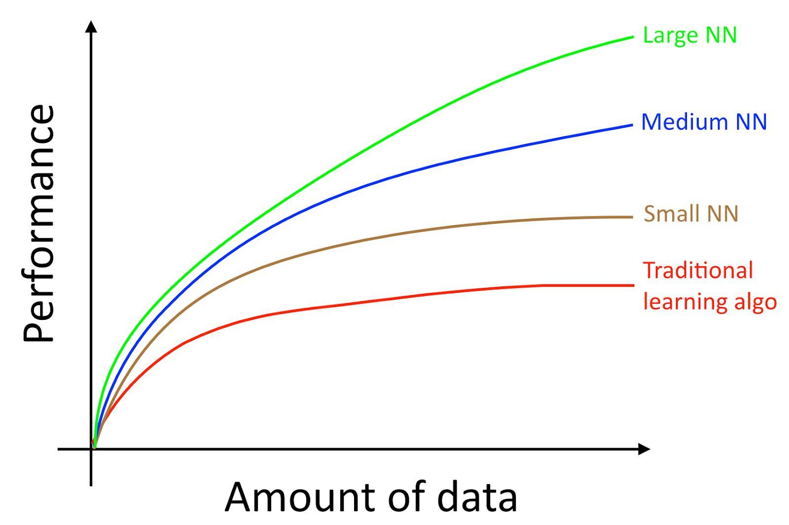

## Chapter 4 规模推动机器学习进度

很多深度学习（神经网络）的想法已经存在数年了，为什么这些想法又重新火了起来呢？

最近能够进度的两大驱动因素是：

- **数据可用性。**人们在数字设备（笔记本电脑，手机）上花费了更多的时间。他们的数字化活动产生了大量的数据，我们可以把这些数据用于训练我们的算法。
- **计算尺度。**我们在几年前就开始能够去训练足够大的神经网络，以利用我们拥有的庞大数据集。

具体来说，即使你累积了了更多的数据，对于传统的学习方法比如逻辑回归（logistic regression）效果会出现“高原”。意味着它的学习曲线“变得平坦”，并且即使提供再多的数据，算法也会停止改进：

看起来像传统的算法不知道怎么利用我们给的所有的数据。

如果对于同样一个有监督学习的任务，你训练了一个小型的神经网络，你可能会获得一个稍微好一些的结果。

这里说的小型神经网络，我们是指具有较少的隐藏单元/层数/参数。最后，如果你训练了越来越大的神经网络，你可以获得更好的性能[1]:

所以，当你做到以下两点时你会获得更好的性能（i）训练一个非常大的神经网络，于是你就会得到上图中的绿色曲线效果；（ii）拥有大量的数据。

很多其他的细节比如神经网络架构一样是非常重要的，这里面也有很多可以创新。但是今天提高算法性能的更加可靠的方法之一仍然是（i）训练更大的网络和（ii）获取更多的数据。

如何完成（i）和（ii）的过程非常复杂。本书将详细讨论细节。我们将从对传统机器学习算法和神经网络都有效的一般策略开始，并使用最现代的策略来构建深度学习系统。

---

[1]. 该图显示了神经网络在小数据集上效果更好。这种效果表现不像神经网络在大数据集上表现效果良好那么一致。在较小的数据集中，取决于特征如何手工设计，传统机器学习算法可能表现的更好也可能表现不会更好。例如，你有一个20个训练样本，那么使用逻辑回归还是神经网络，可能都无关紧要；手工设计的特征将会比算法有更大的影响。但是如果你有100万个样本，我将会赞成神经网络。

