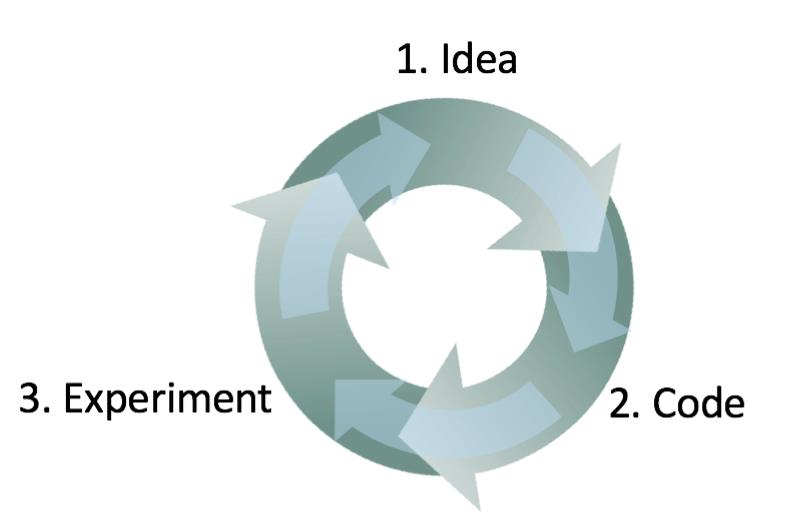

## 10. 使用开发集和评估指标来加速迭代

实现了解哪种方法最适合解决新问题是非常困难的。即使是有经验的机器学习研究者通常在找到令人满意的方案前也会尝试几十个想法。在建立机器学习系统时，我经常会：

1. 首先想一些如何构建系统的**想法（idea）**。
2. 用**代码(code)**实现这些想法。
3. 进行**实验（experiment）**来告诉我这个想法多好。（通常我的第一个想法不起作用！）给予这些学习，回过头产生更多的想法，并继续迭代。

这是一个迭代的过程。这个循环你哦组的越快，你取得进展的速度就越快。这也是开发集/测试集的度量标准非常重要的原因：每当尝试一个想法时，在开发集上衡量你想法的性能并快速的决定是否朝着正确的方向前进。

相反，假设你没有特定的开发集和度量标准。因此，每当你你的团队开发一个新的猫分类器的时候，你必须把它整合进你的应用中，并与玩应用几个小时候来感知新的分类器是否有所改进。这种方法非常慢！另外，如果你的团队将分类器的准确率从95.0%提升到了95.1%，通过玩该应用可能无法感知这0.1%的提升。然而，通过逐步积累这0.1%的进度，你的系统将会取得很大进步。拥有开发集和度量标准，可以让你快速的发现哪些想法成功的提供了小的（或大的）的改进，因此可以让你快速的决定想法可以继续改进，哪些想法应该丢弃。
