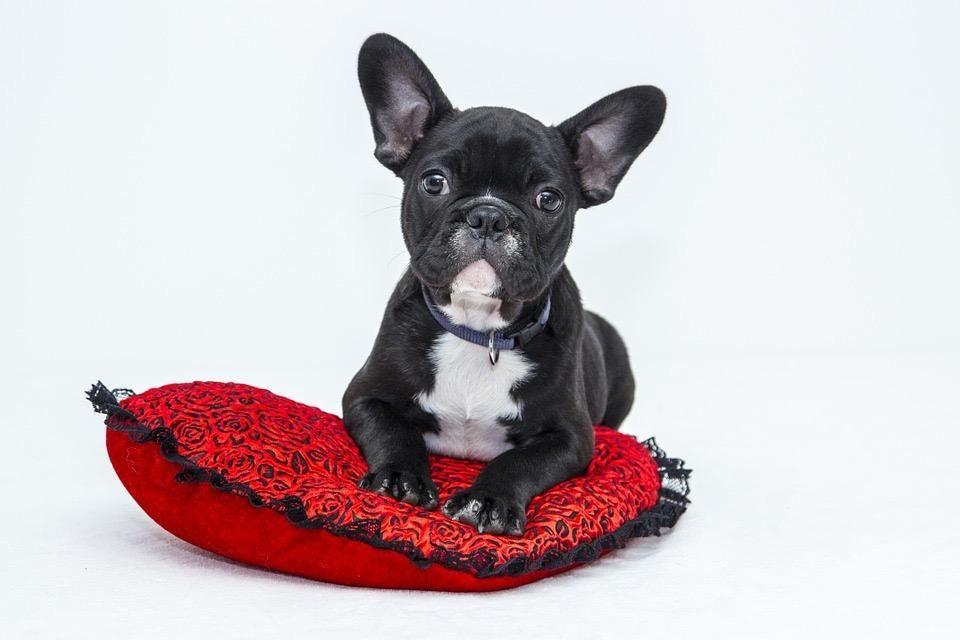

## 14. 错误分析：查看开发集的例子来评估想法

当你使用你的猫应用程序，你会注意到把狗误认为是猫的例子。一些狗很像猫！

一个团队成员建议加入可以使系统在狗图像上做的更好的第三方软件。这将需要一个月的时间，团队成员非常热情。应该让他们继续吗？

在投入一个月时间来完成这项任务之前，我建议你首先评估一下它能够真正提高多少系统的准确率。然后你可以更合理的决定是否值得开发一个月，或者你最好在其他任务上使用这段时间。

详细的说，这是你可以做的事情：

1. 收集100个系统错误分类的开发集样本，即，你的系统发生错误的样本。

2. 手动查看这些样本，并计算它们中狗的图像占的比例。

查看错误样本的过程称为**错误分析**。在这个例子中，如果你发现只有5%的错误分类图像是狗，那么无论你如何改进狗的图像识别算法，你都不会消除5%以上的狗。换句话说，5%是做这个提议的项目可以提供多少帮助的“上限”（意思是最大可能数额）。因此，如果你的系统目前有90%的准确率（10%的误差），那么这种改进最好的结果是90.5%的准确率（或9.5%的误差，比原来的10%的误差小5%）。

