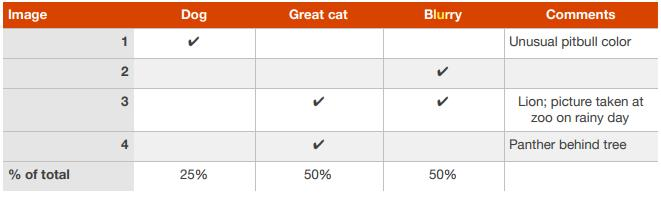
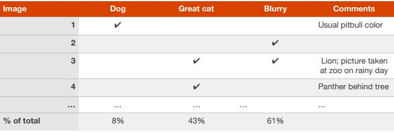

## 15. 在错误分析中并行评估多个想法

为了改进猫检测器，你的团队有以下几个想法：

- 修正算法中将*狗（dogs）*识别为猫的问题。
- 修正算法中将*大型猫科动物（great cats）*（狮子，豹等）识别为家猫的问题。
- 修正系统在*模糊（blurry）*图像上的表现。
- ...

你可以并行有效的评估这些所有的想法。我通常会建立一个表格，并在查看大约100个开发集上的错误样本的时候填写它。我也会记下可能帮助我分析具体例子的注释。为了说明这个过程，我们来看一个电子表格，它可能是你处理一个由开发集上的4个样本组成的表格：

上面的图像#3同时属于大型猫科（Great Cat)和模糊（Blurry）图像列。还有，因为一个示例可能与多个类别关联，因此底部的百分比加起来可能不是100%。

尽管你可能先指定类别（狗，大型猫科，模糊图像），然后手动对实例进行分类，但在实践中，一旦你开始浏览示例，你可能会受到启发，提出新的错误。例如，假设你浏览了十几张图片，并意识到Instagram滤镜图片会出现很多错误。你可以回去杂电子表格中添加Instagram列。手动查看错误分类示例，并问作为人你是否/如何将图片分类通常会激发你提出新的错误类别和解决方案。

你有想法可以改进的错误类别才是最有帮助的错误类别。加入，如果有可以“撤销”Instagram滤镜并恢复原始图像的方法，那么Instagram类别将是可以做的最有帮助的类别。但是你不必只限制自己到你知道如何改进的错误类别，这个过程的目标是建立你关于最希望关注的领域的直觉。

错误分析是一个迭代的过程。如果你开始没有考虑到任何类别，也不要担心。看过几幅图像后，你可能会想出一些关于错误类别的想法。在对某些图像进行手动分类后，你可能考虑新的类别并根据新的类别进行重新检查图像等等。

假设你完成对100个开发集上的错误分类示例并得到一下结果：

你现在知道，处理狗错误的项目最多可以消除8%的错误。处理大型猫科或模糊图像错误可能有助于消除更多错误。因此，你可以选择两个类别中的一个来关注。如果你的团队有足够多的人可以分别追求多个方向，你可以让一些工程师来做大型猫科的，另外一些人来做模糊图像的。

错误分析并不会产生一个告诉你最优先的任务是什么的数学公式。你还必须考虑在不同类别上可以期望取得的进展集解决每个类别所需要的工作量。

