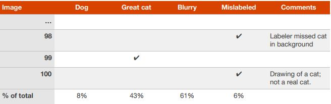

## 16. 清理错误标记的开发集和测试集样例

在错误分析期间，你可能会主意到你的开发集中有一些示例被“错误标记（mislabeled）”了。我这里说的“错误标记，是指在算法遇到图片之前，图片已经被人为的贴上了错误的标签。比如，样本（x，y）中的类标签y是不正确的。例如，也许一些不是猫的图片被误认为是包含猫，反之亦然。如果你怀疑错误标记的图像部分很重要，那么请添加一个用于跟踪错误样本部分的类别。

你应该纠正你的开发集中的错误标签吗？请记住，开发集的目的是帮助你快速的评估算法以便能够区分算法A和B哪个更好。如果被错误标记的开发集部分影响了你对这些判断你的能力，那么花时间来修复开发集错误是值得的。

例如，假设你的分类器性能如下：

- 开发集的整体准确率是90%（10%的错误率）
- 错误标记的样本引起的错误0.6%（占开发集错误6%）
- 由于其他原因引起的错误9.4%（占开发集错误94%）

在这里，相对于你可能正在改进的9.4%的错误，标记错误导致的0.6%的错误可能不够重要。在开发集中手动修复错误标记的图像没有什么坏处，但这么重并不重要：不知道你的系统是10%或9.4%的总体错误一样是可以的。

假设你不断改进猫分类器性能并达到以下性能：

- 开发集的整体准确率98.0%（整体错误率2.0%）
- 错误标记的样本引起的错误0.6%（占开发集错误30%）
- 由于其他错误导致的错误1.4%（占开发集错误70%）

你错误的30%是由于开发集错误标记引起的，这会给你的准确率估计增加显著的错误。现在值得提高开发集中标签的质量。处理错误标记的例子将帮助你找出分类器的错误是接近1.4%还是2%——这是一个显著的差异。

开始时容忍一些错误标记的开发集/测试集示例并不罕见，只是随着系统改进时改变这个主意，因为错误标记示例的比例随着总的错误率降低而增长。

最后一章解释了如何通过算法改进错误类别，例如狗，大型猫科，模糊图像。在本章中，你已经了解到可以改进错误标记的类别来改进数据标签。

无论你怎么处理来修复开发集标签，请记住要将其一同应用于测试集，以便你的开发集和测试集继续服从同一分布。将开发集和测试集一起处理可以避免我们在第6章提到的问题，这个问题是，你的团队优化了开发集的性能，只是后来才意识到他们是根据不同的准则在不同的测试集上判断的。

如果你决定提高标签质量，请考虑仔细检查系统错误分类的样本的标签以及正确分类的样本的标签。在一个例子中，原始标签和学习算法都可能是错误的。如果你锦绣福错误分类的样本的标签，你可能会在评估中引入偏差（bias）。如果你有1000个样本的开发集，并且开发集的准确率是98.0%，那么检查误分类的20个样本比检查正确分类的980个样本更加容易。因为在实践中检查错误分类的样本比较容易，所以偏差会蔓延到开发集中。如果你只对开发产品和应用感兴趣，这种偏差是可以接受的，但是如果你计划在研究论文中使用结果或者需要一个完全无偏差的测量测试集准确率，则会是个问题。

