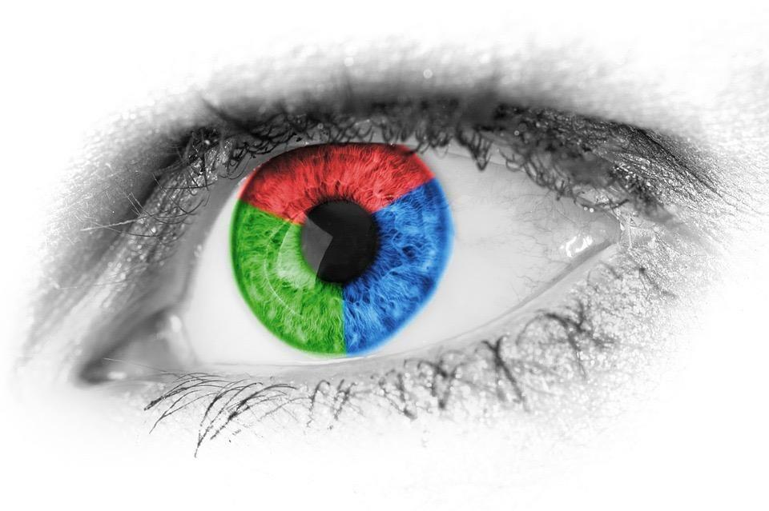
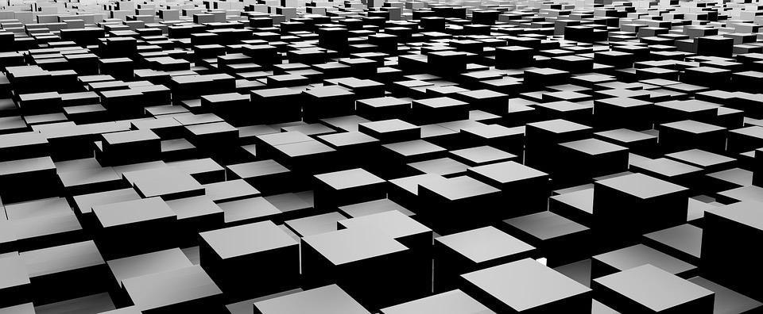

## 18. 眼球开发集和黑盒开发集应该多大？

你的眼球开发集应该足够大，以便让你了解算法的主要错误类别。如果你正在从事一项人类可以表现良好的任务（如识别图像中的猫），以下是一些粗略的指导方针：

- 你的分类器出现10次错误的眼球开发集被视为非常小。只有10个错误，将很难准确估计不同类别的影响。但是如果你的数据集非常少，无法承受更多投入到眼球开发集中，那么最好不要选择（错误类别），并且有助于项目优先级。
- 如果你的分类器在眼球开发集上犯了20个错误，你会开始粗略的了解主要错误来源。
- 如果大约50个错误，你将会很好的理解主要错误来源。
- 如果大约100个错误，你将很清楚的错误的主要来源。我看到人们手动分析更多的错误——有时多达500个，只要你有足够的数据，就不会有什么坏处。

假设你的分类器有5%的错误率。为了确保在眼球开发集上有大约100个错误分类的样本，眼球开发集必须有大约2000个样本（因为0.05 * 2000 = 100）。分类器的错误越低，你的眼球开发集越大，以便能够获得足够多的错误来分析。

如果你正在做一个人类做不好的任务，那么在眼球开发集上进行检查练习就没有什么帮助，因为它很难找出算法为什么没有正确分类样本。在这种情况下，你可以忽略设置眼球开发集。我们在后面的章节中讨论这些问题的指导原则。

那黑盒开发集如何设置呢？我们之前说过，1000-10 000个样本的开发集是很常见的。为了完善这一陈述，尽管获取更多的数据几乎没什么坏处，1000-10 000个样本通常会给你提供足够多的数据用于超参数的调整和模型的选择。一个100个样本的黑盒开发集是很小但是仍然有用。

如果你有一个很小的开发集，那么你可能没有足够多的数据来拆分成足够大的眼球和黑盒开发集来满足他们各自的目的。相反，你的开发集可能不得不全部用作眼球开发集——即，你将手动检查所有开发集数据。

在眼球开发集和黑盒开发集之间，我认为眼球开发集更重要（假设你正在研究人类可以很好解决的问题，并且检查这些样本可以帮助你获得洞察力）。如果你只设置了眼球开发集，则可以在该数据集上进行错误分析、模型选择和超参数调整。仅设置眼球开发集的缺点是过拟合开发集的风险更大。

如果你有足够多的数据可以使用，那么眼球开发集的大小主要取决于你有多少时间用于手动分析样本。例如，我很少见到有人手动分析超过1000个错误。
