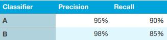
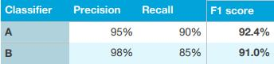

## 8. 为你的团队进行算法优化建立一个单数字估指标

分类准确率（accuracy）是单数评估指标的一个例子：你可以在开发集（或测试集）上跑你的分类器，然后获取一个分类正确比例的数字。根据这个度量，如果A分类器的准确率是97%，B的准确率是90%，那么我们可以判断A是优于B的。

相比之下，精确率（Precision）和召回率（Recall）[3]不是单数的评估指标：它给出了用于评估分类器的两个指标。拥有多个评估指标会使得算法的比较变得更加困难。假设你的算法表现如下：

这里，两个分类器都没有明显的优势，所以它不会引导你立即从中选择一个。

在开发过程中，你的团队将尝试大量有关算法体系的结构，特征的选择等。使用**单数评估指标**比如准确率（accuracy）会使你从你的所有模型中选择根据此单数评估指标选择性能表现最好的那一个，并且迅速决定哪个是表现最好的。

如果你真的特别关心精确率和召回率，我建议你使用一个标准的方法将它们合并成一个数字。例如，可以使用精确率和召回率的算术平均值作为评价指标。或者，你可以使用F1值（F1 score），这是一种计算它们调和平均数的指标，比简单的求算术平均数效果更好[4]。

当你面临大量分类器进行选择的时候，使用单数评估指标可以加快你作出决定的能力。它对所有的分类器的好坏都给出明确的排名，因此会有一个明确的进展方向。

最后一个例子，假设你分别在四个关键市场（i）美国，（ii）中国，（iii）印度和（iv）其他来跟踪猫分类器的准确率。这就有了四个指标。通过对这个四个数字求其算术平均值或者加权平均来得到一个单数评估指标。取平均值或者加权平均值是将多个评估指标合并为一个的最常用方法之一。

—————————————————————————————

[3]. 精确率是分类器标记为猫的样本中实际标签确实为猫的个数占分类器标记为猫的个数的比例。召回率是分类器标记为猫样本中实际标签确实为猫的个数占数据集中所有标签为猫的个人的比例。通常需要在高精确率与高召回率之间进行权衡。

[4]. 如果你想了解更多关于F1值得信息，请查看https://en.wikipedia.org/wiki/F1_score 。它是精确率和召回率的调和平均数，计算方法：2/
((1/精确率)+(1/召回率))

